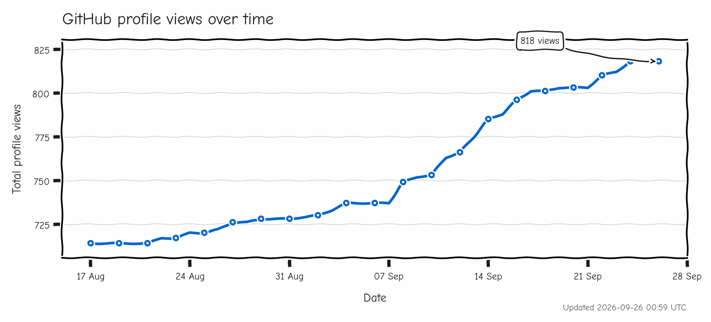

  
  <h1>Matthew J. Doyle, PhD</h1>

Interested in computing, software architecture, numerical methods, experiment design, and the mathematics of complex and chaotic physical systems.

## About Me

* PhD in Physics from the University of Manchester, specialising in numerical simulation and experimental visualisation of quantum turbulence.
* Experienced in scientific computing with C++, Fortran, Python, MATLAB and shell scripting.
* Particularly interested in numerical methods, N-body algorithms, Monte Carlo methods and computational modelling.
* Experience contributing to RLHF for frontier LLM training.
* Maintainer of several free-to-use web applications and interactive demos: [matthewd0yle.com/portfolio](https://matthewd0yle.com/portfolio)
* Experimenting with local and open-weight LLMs, agentic automations and AI powered software.

## Get in Touch

- [LinkedIn](https://www.linkedin.com/in/matthewjdoyle)
- [Email](mailto:matt@matthewd0yle.com)

## Website Pages of Interest

- [Home](https://matthewd0yle.com/)
- [Web Portfolio](https://matthewd0yle.com/web-portfolio)
- [Articles](https://matthewd0yle.com/articles)
- [Research Publications List](https://matthewd0yle.com/publications)
- [Visual Gallery](https://matthewd0yle.com/gallery)

 

---

### I always enjoy a graph.

  

<!-- 

  

 -->

 

---

Just here for the xp.
 

